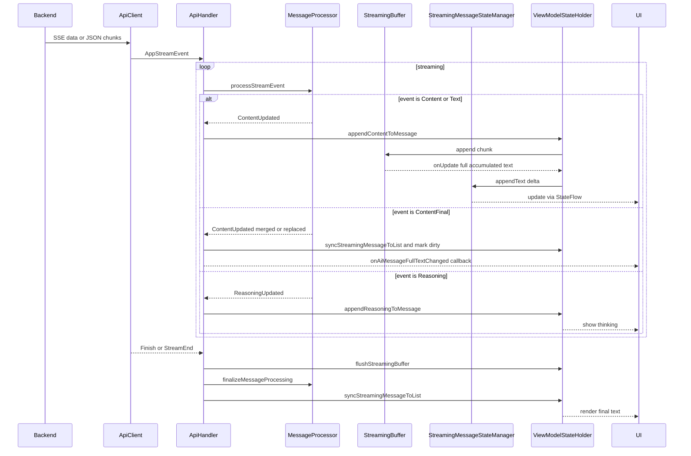
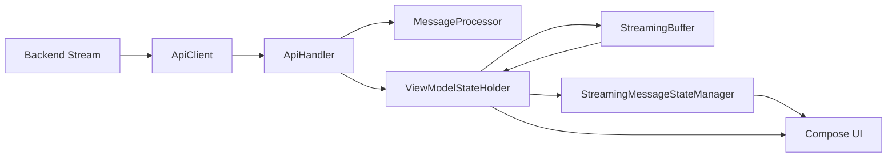

# AI 输出流式处理架构概览

本文梳理端到端数据流、核心组件与决策点，配套事件时序与UI节流架构图，便于评审与优化。

参考实现位置
- 事件解析: [ApiClient.parseBackendStreamEvent()](KunTalkwithAi/app1/app/src/main/java/com/example/everytalk/data/network/ApiClient.kt:58)
- 事件模型: [AppStreamEvent](KunTalkwithAi/app1/app/src/main/java/com/example/everytalk/data/network/AppStreamEvent.kt:7)
- 流式入口: [ApiHandler.streamChatResponse()](KunTalkwithAi/app1/app/src/main/java/com/example/everytalk/statecontroller/ApiHandler.kt:169)
- 事件分派: [ApiHandler.processStreamEvent()](KunTalkwithAi/app1/app/src/main/java/com/example/everytalk/statecontroller/ApiHandler.kt:422)
- 分块处理: [MessageProcessor.processStreamEvent()](KunTalkwithAi/app1/app/src/main/java/com/example/everytalk/util/messageprocessor/MessageProcessor.kt:39)
- 最终定稿: [MessageProcessor.finalizeMessageProcessing()](KunTalkwithAi/app1/app/src/main/java/com/example/everytalk/util/messageprocessor/MessageProcessor.kt:111)
- content_final 验证: [ContentFinalValidator.shouldReplaceCurrent()](KunTalkwithAi/app1/app/src/main/java/com/example/everytalk/util/messageprocessor/ContentFinalValidator.kt:29)
- UI节流缓冲: [StreamingBuffer](KunTalkwithAi/app1/app/src/main/java/com/example/everytalk/statecontroller/StreamingBuffer.kt)
- UI观测状态: [StreamingMessageStateManager](KunTalkwithAi/app1/app/src/main/java/com/example/everytalk/statecontroller/StreamingMessageStateManager.kt)
- 消息写回与同步: [ViewModelStateHolder.appendContentToMessage()](KunTalkwithAi/app1/app/src/main/java/com/example/everytalk/statecontroller/ViewModelStateHolder.kt:692)

时序图


组件拓扑


关键决策点
- content_final 合并策略: 优先 replace 的场景包括严格前缀扩展、长度接近前缀一致、格式化改进、围栏闭合更优；否则采用保守合并，避免倒退或闪烁。详见 [ContentFinalValidator.shouldReplaceCurrent()](KunTalkwithAi/app1/app/src/main/java/com/example/everytalk/util/messageprocessor/ContentFinalValidator.kt:29) 与 [ContentFinalValidator.mergeContent()](KunTalkwithAi/app1/app/src/main/java/com/example/everytalk/util/messageprocessor/ContentFinalValidator.kt:86)。
- 最终文本选择: content_final 到达时优先使用处理器合并后的文本，其次 fallback event.text，再次 fallback 当前 message.text，详见 [ApiHandler.processStreamEvent()](KunTalkwithAi/app1/app/src/main/java/com/example/everytalk/statecontroller/ApiHandler.kt:473)。
- UI节流路径: Buffer 近实时全量回调结合 StreamState 的最小批与自适应间隔，二者共同降低重组成本与列表写回频率，详见 [StreamingBuffer.append()](KunTalkwithAi/app1/app/src/main/java/com/example/everytalk/statecontroller/StreamingBuffer.kt:78) 与 [StreamingMessageStateManager.appendText()](KunTalkwithAi/app1/app/src/main/java/com/example/everytalk/statecontroller/StreamingMessageStateManager.kt:85)。
- 错误处理与重试: 网络错误检测与重试提示在 [ApiHandler.updateMessageWithError()](KunTalkwithAi/app1/app/src/main/java/com/example/everytalk/statecontroller/ApiHandler.kt:703) 与 [ApiHandler.isNetworkError()](KunTalkwithAi/app1/app/src/main/java/com/example/everytalk/statecontroller/ApiHandler.kt:944)。
- 取消与部分保存: 取消时 flush 并保存部分文本、移除占位消息与清理流式状态，详见 [ApiHandler.cancelCurrentApiJob()](KunTalkwithAi/app1/app/src/main/java/com/example/everytalk/statecontroller/ApiHandler.kt:68)。

已识别的评审关注
- 双缓冲职责边界与刷新频率的最优组合，避免重复更新路径导致的冗余开销。
- finalize 的空文本异常保护点，确保上游至少保证一个非空来源或在异常时以空串回退但记录错误。
- 网络错误分类的精细化，避免业务错误被误判为可重试网络错误。
- 取消触发保存策略的产品一致性，明确何时保存partial及用户可见提示。

下一步建议
- 补充边界用例集覆盖 content_final 的各类场景，生成对比日志样本。
- 评估是否以 StreamState 为主、Buffer 为辅，或反之，给出配置建议与指标目标。
- 在处理器和验证器增加可配置日志级别与开关，便于线上问题定位。

---

## 双缓冲策略评审与配置建议

目标
- 降低 Compose 重组与列表写回的总开销，保证流式观感稳定。
- 明确“唯一真源”：UI展示以谁为准，另一方仅做约束或聚合。

现状小结
- StreamingBuffer 当前近实时：`updateInterval=16ms`、`batchThreshold=1` 且在 [StreamingBuffer.append](KunTalkwithAi/app1/app/src/main/java/com/example/everytalk/statecontroller/StreamingBuffer.kt:78) 中直接 `performFlush()`，每块都全量文本回调，推动 `ViewModelStateHolder.appendContentToMessage()` 全量写回消息列表。
- StreamingMessageStateManager 侧有最小批与自适应防抖，面向 UI 观测（StateFlow），减少重组频率。

风险
- 双轨同时推进 UI，存在重复刷新路径与潜在不一致。
- Buffer 的“每次全量文本回调”与 StateFlow 的增量合并并行，浪费主线程合成预算。

建议的职责划分
- “唯一真源”为 StreamingMessageStateManager 的 StateFlow（UI直接订阅此流）；消息列表的 `message.text` 仅在关键节点同步（如 content_final、Finish/StreamEnd 以及暂停恢复一次性同步）。
- StreamingBuffer 专注于限制“写回消息列表”的频率与规模，而不是驱动每帧 UI 内容。

推荐参数与改动
1) StreamingBuffer
- 建议参数：`updateInterval=120~180ms`，`batchThreshold=30~64 chars`
- 取消 append 中的即时 flush：移除/改写 [StreamingBuffer.append](KunTalkwithAi/app1/app/src/main/java/com/example/everytalk/statecontroller/StreamingBuffer.kt:78) 对 `performFlush()` 的直接调用，回归定时/阈值触发（可通过 [scheduleDelayedFlush](KunTalkwithAi/app1/app/src/main/java/com/example/everytalk/statecontroller/StreamingBuffer.kt:109)）
- 回调内容建议维持“全量文本”，但仅在关键节点使用（Finish/StreamEnd、暂停恢复、ContentFinal），流式过程中消息列表不必每次写回。

2) StreamingMessageStateManager
- 保持现有自适应策略即可；可将阈值微调为：`MIN_CHARS_TO_FLUSH=24~48`、`DEBOUNCE_MS=100~150`，入口见 [appendText](KunTalkwithAi/app1/app/src/main/java/com/example/everytalk/statecontroller/StreamingMessageStateManager.kt:85) 的阈值常量声明位置。

3) ApiHandler 更新路径
- Content/Text 事件：仅调用 `streamingMessageStateManager.appendText()`，避免频繁触发 `appendContentToMessage()` 对消息列表的全量写回，落点在 [ApiHandler.processStreamEvent](KunTalkwithAi/app1/app/src/main/java/com/example/everytalk/statecontroller/ApiHandler.kt:441)。
- ContentFinal / Finish：调用 `flushStreamingBuffer()` 与 `syncStreamingMessageToList()`，一次性把最终文本同步到消息列表，落点在 [ApiHandler.processStreamEvent](KunTalkwithAi/app1/app/src/main/java/com/example/everytalk/statecontroller/ApiHandler.kt:594)。
- 暂停/恢复：恢复时通过 [ApiHandler.flushPausedStreamingUpdate](KunTalkwithAi/app1/app/src/main/java/com/example/everytalk/statecontroller/ApiHandler.kt:1092) 一次性对齐。

监控与回退
- 指标：平均 flush 间隔、每秒重组次数、丢帧率、消息列表写回次数。必要时将 Buffer interval 提高到 150~200ms 以换取稳定性。
- 开关：在 `PerformanceConfig` 中新增“buffer_real_time_mode”布尔切换，便于 A/B。

落地顺序（建议）
- 第1步：禁用 Buffer 的即时 flush，采用阈值/定时；UI以 StateFlow 为真源。
- 第2步：确保 content_final 与 finish 场景的消息列表同步逻辑完整可测。
- 第3步：打点指标，观察重组与写回次数下降幅度。


## content_final 边界用例清单

验证目标
- 确保 `shouldReplaceCurrent` 与 `mergeContent` 行为在各边界下不会“倒退/闪烁/截断”。

用例集合
- 严格前缀扩展：最终文本 = 当前文本 + 新尾巴（应替换）。
- 近似清理：长度±15%，前100前缀一致（应替换），参考 [shouldReplaceCurrent](KunTalkwithAi/app1/app/src/main/java/com/example/everytalk/util/messageprocessor/ContentFinalValidator.kt:51)。
- 围栏闭合改进：``` 或 $$ 从奇数到偶数配对（应替换），评分逻辑见 [fenceClosureScore](KunTalkwithAi/app1/app/src/main/java/com/example/everytalk/util/messageprocessor/ContentFinalValidator.kt:108)。
- 中段重排：最终文本对当前文本的某中段进行了重写但整体非前缀（应保守合并或保持）。
- 大幅变短：最终文本长度 < 当前的50%（禁止替换），见 [shouldReplaceCurrent](KunTalkwithAi/app1/app/src/main/java/com/example/everytalk/util/messageprocessor/ContentFinalValidator.kt:39)。
- 去重修正：最终文本减少重复段落且总长接近（倾向替换）。
- 空白/换行清理：多余空行/行尾空白显著减少且语义相近（倾向替换），参考 [detectFormattingImprovement](KunTalkwithAi/app1/app/src/main/java/com/example/everytalk/util/messageprocessor/ContentFinalValidator.kt:135)。

验证方法
- 以固定的分块序列驱动 `MessageProcessor.processStreamEvent()`，在 ContentFinal 后读取 `getCurrentText()`，断言与预期一致。
- 记录启发式命中路径，便于线下微调阈值。


## finalize 空文本保护建议

现状
- 当 `currentText` 与 `message.text` 均为空时，`finalizeMessageProcessing` 抛异常，见 [MessageProcessor.finalizeMessageProcessing](KunTalkwithAi/app1/app/src/main/java/com/example/everytalk/util/messageprocessor/MessageProcessor.kt:111)。

建议
- 产品策略选择：
  - 推荐方案：返回空串但写入错误日志，并标记 `contentStarted=true` 以完成收尾，避免异常打断收敛；由上层以“空响应”统一呈现。
  - 或保留抛错，但在 ApiHandler 的 Finish 路径上添加前置保障（若均为空则回退 event.text 或 streamingState 内容）。
- 落点：在 `ApiHandler.processStreamEvent` Finish 分支中增加前置非空保障，或在 `finalizeMessageProcessing` 做软回退。


## 网络错误识别与重试分类建议

现状
- [isNetworkError](KunTalkwithAi/app1/app/src/main/java/com/example/everytalk/statecontroller/ApiHandler.kt:944) 通过字符串匹配进行判定。

建议
- 结合 Ktor 异常类型：`HttpRequestTimeoutException`、`ServerResponseException`、`ClientRequestException`、`ResponseException` 分层处理。
- 4xx 非鉴权类错误默认非重试；5xx 与超时/连接错误可重试。
- 上限可调：`MAX_RETRY_ATTEMPTS` 依错误类型区分（如超时3次，连接失败2次）。
- 日志采样记录重试链路，便于线上回溯。


---

## 取消与部分内容保存的产品一致性选项

现状
- 用户取消/新请求触发取消后，会尝试保存 partial，并清理 StreamingBuffer 与流式状态，参见 [ApiHandler.cancelCurrentApiJob](KunTalkwithAi/app1/app/src/main/java/com/example/everytalk/statecontroller/ApiHandler.kt:68)。

一致性策略建议
- 统一保存规则
  - 用户主动取消：若 currentText 非空则保存 partial，设置消息状态为“已取消但保留输出”；反之删除仅占位的空AI消息。实现点：[ApiHandler.cancelCurrentApiJob](KunTalkwithAi/app1/app/src/main/java/com/example/everytalk/statecontroller/ApiHandler.kt:68) 内已有分支，补充状态字段或统一UI提示。
  - 新流打断旧流：与上规则一致，但在消息尾部附加“已被新的请求中断”标记，可通过 currentWebSearchStage 或独立字段表达。
- UI 提示一致性
  - 气泡尾部灰色小字“已取消，已保留部分内容”或“被新请求中断”。由 UI 层根据 `isError=false && contentStarted=true && finishReason=cancelled/interrupted` 决定展示。
- 历史持久化
  - 取消即刻调用 saveCurrentChatToHistoryIfNeeded(forceSave=true)。落点现有：[ApiHandler.cancelCurrentApiJob](KunTalkwithAi/app1/app/src/main/java/com/example/everytalk/statecontroller/ApiHandler.kt:68) 中已有保存逻辑，确保异常分支也调用。

实施要点
- 为消息新增 `finishReason` 字段或沿用 `currentWebSearchStage` 有限集；在 [updateMessageWithError](KunTalkwithAi/app1/app/src/main/java/com/example/everytalk/statecontroller/ApiHandler.kt:703) 与取消路径统一赋值和UI消费。


## 网络错误识别与重试分类（细化方案）

异常分类
- 连接类/可重试
  - 超时：HttpRequestTimeoutException（Ktor）、Socket 超时（IOException 文案含 timeout）
  - 连接失败：ConnectException、UnresolvedAddressException（IOException 文案含 connection/failed to connect/unreachable）
  - 上游 5xx：ServerResponseException
- 非重试（默认）
  - 4xx 非鉴权：ClientRequestException 但不包含 401/403；提示用户修改内容或稍后再试
  - 业务错误/限制：从 body 文案识别如“区域限制/上游错误/非json”，保持现状作为非网络错误
- 条件重试
  - 429/限流：指数回退，最多2次，间隔 1.5s/3s

落地改动
- 在 [isNetworkError](KunTalkwithAi/app1/app/src/main/java/com/example/everytalk/statecontroller/ApiHandler.kt:944) 基于异常类型优先判断，再降级到 message 文案匹配，避免误判。
- 在 [updateMessageWithError](KunTalkwithAi/app1/app/src/main/java/com/example/everytalk/statecontroller/ApiHandler.kt:703) 中依据错误类型选择 MAX_RETRY_ATTEMPTS 与延迟策略（如 timeout=3、connect=2、429=2 with backoff）。
- 错误文案建议：网络类前缀“网络通讯故障”，业务类保留原信息（已有分支逻辑，可延用）。

监控
- 记录 retry 类型分布与成功率，便于后续调参。


## content_final 边界用例（可执行用例矩阵）

用例矩阵（示例，供测试实现）
- 用例1 严格前缀扩展：current="abc", final="abcXYZ" → replace=true
  - 命中 [shouldReplaceCurrent](KunTalkwithAi/app1/app/src/main/java/com/example/everytalk/util/messageprocessor/ContentFinalValidator.kt:45)
- 用例2 近似清理：current 与 final 长度±15%，前100字符一致 → replace=true
  - 命中 [shouldReplaceCurrent](KunTalkwithAi/app1/app/src/main/java/com/example/everytalk/util/messageprocessor/ContentFinalValidator.kt:51)
- 用例3 围栏闭合：current 有 1 个 ```，final 有 2 个配对 ``` → replace=true
  - 命中 [fenceClosureScore](KunTalkwithAi/app1/app/src/main/java/com/example/everytalk/util/messageprocessor/ContentFinalValidator.kt:108)
- 用例4 大幅变短：final 长度 < current 的 50% → replace=false
  - 命中 [shouldReplaceCurrent](KunTalkwithAi/app1/app/src/main/java/com/example/everytalk/util/messageprocessor/ContentFinalValidator.kt:39)
- 用例5 中段重排：final 非前缀且重写中段 → merge 保守保留 current
  - 命中 [mergeContent](KunTalkwithAi/app1/app/src/main/java/com/example/everytalk/util/messageprocessor/ContentFinalValidator.kt:86)
- 用例6 去重修正：final 去除了重复段落且总长接近 → replace=true（判定由 formattingImprovement + lengthClose 共同给出）
  - 命中 [detectFormattingImprovement](KunTalkwithAi/app1/app/src/main/java/com/example/everytalk/util/messageprocessor/ContentFinalValidator.kt:135)
- 用例7 空白清理：final 大幅减少连续空行或行尾空白，语义等价 → replace=true
  - 命中 [detectFormattingImprovement](KunTalkwithAi/app1/app/src/main/java/com/example/everytalk/util/messageprocessor/ContentFinalValidator.kt:135)

测试方法
- 通过 `MessageProcessor` 驱动流：Text/Content 分块若干 + ContentFinal；断言 `getCurrentText()` 与预期一致。
- 记录日志：在验证器内保留命中路径的 debug 级日志，便于追溯与调参。


## finalize 空文本异常触发路径与保障

现状与风险
- 当 `currentText` 与 `message.text` 同为空时，[finalizeMessageProcessing](KunTalkwithAi/app1/app/src/main/java/com/example/everytalk/util/messageprocessor/MessageProcessor.kt:111) 抛出异常，可能在极端乱序或后端异常下触发。

保障策略
- 优先在 Finish/StreamEnd 分支中前置保护：若 `currentText.isBlank && message.text.isBlank`，则尝试 fallback 到 StreamState 的 `getCurrentContent(messageId)`（在 [StreamingMessageStateManager.getCurrentContent](KunTalkwithAi/app1/app/src/main/java/com/example/everytalk/statecontroller/StreamingMessageStateManager.kt:214)），否则置空串并记录 error 级日志。
  - 落点：[ApiHandler.processStreamEvent Finish/StreamEnd 分支](KunTalkwithAi/app1/app/src/main/java/com/example/everytalk/statecontroller/ApiHandler.kt:594)。
- 次优软回退：在 [finalizeMessageProcessing](KunTalkwithAi/app1/app/src/main/java/com/example/everytalk/util/messageprocessor/MessageProcessor.kt:111) 中遇到双空时返回空串并记录错误，避免异常中断收敛。
- 记录一次性 breadcrumb（messageId、事件计数、最后3个事件类型），便于线上排障。


## 实施 PRD 草案（含配置与日志开关）

目标
- 提升流式观感稳定性，降低 UI 重组与消息列表写回开销。
- 减少 content_final 倒退/闪烁/截断风险。
- 明确错误/取消时的用户体验一致性。

范围
- 仅涉及前端 App 的流式处理链路（ApiClient→ApiHandler→MessageProcessor→Buffer/StreamState→UI），不改动后端协议。

非目标
- 模型侧 prompt/工具调用策略、后端API语义变更。

方案与参数
- 双缓冲职责收敛：UI 真源 = StreamingMessageStateManager StateFlow；StreamingBuffer 仅用于关键节点写回消息列表。
  - 参数：Buffer updateInterval=120~180ms、batchThreshold=30~64；取消 append 即时 flush，调用 [scheduleDelayedFlush](KunTalkwithAi/app1/app/src/main/java/com/example/everytalk/statecontroller/StreamingBuffer.kt:109)。
- content_final 启发式：保持现状，补充日志采样与测试覆盖（见“边界用例”）。
- finalize 保护：Finish/End 分支添加前置保障 + finalize 软回退兜底。
- 网络错误重试：异常类型优先，限制 5xx/超时/连接类重试；429 指数回退。

可配置项（PerformanceConfig 或 BuildConfig）
- buffer_real_time_mode: bool（默认false）
- buffer_update_interval_ms: int（默认120）
- buffer_batch_threshold: int（默认30）
- enable_content_final_logging: bool（默认true）
- retry_timeouts: int、retry_connect: int、retry_429: int

指标与验收
- 指标：重组/秒（UI profiler）、消息列表写回次数、平均 flush 间隔、丢帧率、用户取消后保留率。
- 验收：在中长文本与代码块场景下，卡顿显著下降，content_final 无视觉倒退。

灰度与回滚
- 通过开关逐步放量；若异常升高，切回 buffer_real_time_mode=true 即时模式（回退策略）。


---

## 优缺点深入分析

本节对当前“AI输出流式处理”各关键策略进行体系化优缺点分析，并结合代码落点提出取舍建议。

### 1) 双缓冲策略：StreamingBuffer + StreamingMessageStateManager

优势
- 降低重组成本：`StateFlow` 层做最小批/防抖，平滑 UI，详见 [StreamingMessageStateManager.appendText](KunTalkwithAi/app1/app/src/main/java/com/example/everytalk/statecontroller/StreamingMessageStateManager.kt:85)。
- 职责分离：Buffer 侧可聚焦“列表写回”的节流，[StreamingBuffer](KunTalkwithAi/app1/app/src/main/java/com/example/everytalk/statecontroller/StreamingBuffer.kt) 可计算 flush 统计与性能指标，利于诊断。
- 回退灵活：通过配置（建议新增 PerformanceConfig）切换“准实时模式”和“节流模式”，便于灰度与快速回滚。

劣势/风险
- 冗余刷新路径：当前 [StreamingBuffer.append](KunTalkwithAi/app1/app/src/main/java/com/example/everytalk/statecontroller/StreamingBuffer.kt:78) 每块直接全量回调，与 `StateFlow` 路径并行，可能造成重复刷新与不一致。
- 列表写回频繁：Buffer 的“全量文本回调”若驱动 `ViewModelStateHolder.appendContentToMessage()` 频繁写回，易引发 Compose 列表重组成本高的问题。

取舍建议
- 收敛“真源”：UI 直接订阅 `StateFlow`，流式期间不强制写回消息列表；Buffer 仅在 ContentFinal/Finish/恢复时进行一次性写回。参数将 Buffer 的 `updateInterval`/`batchThreshold` 提高到 120~180ms / 30~64，移除 append 中的即时 `performFlush()`，使用 [scheduleDelayedFlush](KunTalkwithAi/app1/app/src/main/java/com/example/everytalk/statecontroller/StreamingBuffer.kt:109)。

### 2) ContentFinalValidator 启发式（替换 vs 保守合并）

优势
- 视觉稳定：优先检测“严格前缀扩展/格式化改进/围栏闭合更好”等强信号，减少 content_final 导致的倒退或闪烁，见 [ContentFinalValidator.shouldReplaceCurrent()](KunTalkwithAi/app1/app/src/main/java/com/example/everytalk/util/messageprocessor/ContentFinalValidator.kt:29)。
- 结构友好：围栏/数学公式闭合评分 [fenceClosureScore](KunTalkwithAi/app1/app/src/main/java/com/example/everytalk/util/messageprocessor/ContentFinalValidator.kt:108) 关注代码块/数学渲染的完整性。

劣势/风险
- 误判边界：中段重排、去重修正与局部重构等非前缀型变化，启发式容易偏保守，出现“看似不更新”的体验。
- 配置不可见：阈值（±15%、50%长度等）为硬编码，难以按不同模型/后端行为动态调优。

取舍建议
- 增加配置开关：`enable_content_final_logging` 与阈值参数化，线上采样日志命中路径（替换/合并/保留），定期回顾。
- 增加“中度变化”策略：当 `lengthClose` 且“重复段落显著减少”时倾向替换（现已通过 [detectFormattingImprovement](KunTalkwithAi/app1/app/src/main/java/com/example/everytalk/util/messageprocessor/ContentFinalValidator.kt:135) 部分覆盖，可再细化重复行检测）。

### 3) finalizeMessageProcessing 严格性

优势
- 问题显性化：当 `currentText` 与 `message.text` 双空时抛异常，能第一时间暴露“流式管线缺块或乱序”的严重问题，见 [MessageProcessor.finalizeMessageProcessing()](KunTalkwithAi/app1/app/src/main/java/com/example/everytalk/util/messageprocessor/MessageProcessor.kt:111)。

劣势/风险
- 稀有场景炸裂：偶发后端异常或流式乱序导致双空会直接中断流程，用户端体验为“消息终止无反馈”。

取舍建议
- Finish 分支前置保障：在 [ApiHandler.processStreamEvent Finish/StreamEnd](KunTalkwithAi/app1/app/src/main/java/com/example/everytalk/statecontroller/ApiHandler.kt:594) 增加“若双空则拉取 [StreamingMessageStateManager.getCurrentContent](KunTalkwithAi/app1/app/src/main/java/com/example/everytalk/statecontroller/StreamingMessageStateManager.kt:214)；仍空则置空串+错误日志”的兜底。
- 保留抛错为可配置开关（默认关闭抛错，记录错误并收敛为空串），降低线上爆炸半径。

### 4) 网络错误识别与重试分类

优势
- 可恢复性：对超时/连接失败/5xx/429 区分重试策略，能实质提升成功率，落点 [ApiHandler.updateMessageWithError()](KunTalkwithAi/app1/app/src/main/java/com/example/everytalk/statecontroller/ApiHandler.kt:703) 与 [isNetworkError](KunTalkwithAi/app1/app/src/main/java/com/example/everytalk/statecontroller/ApiHandler.kt:944)。
- 体验友好：提示“正在重试…”并采样日志，用户可感知系统努力恢复。

劣势/风险
- 误判可能：仅依靠字符串匹配的方案容易把业务错误当网络错误，造成无效重试与用户困惑。
- 节流策略复杂：不同错误采用不同退避时间和上限，配置复杂度较高。

取舍建议
- 类型优先：优先使用 Ktor 异常类型与 HTTP 状态区分，再降级字符串匹配；为 429 加指数回退。
- 配置化：MAX_RETRY_ATTEMPTS 与延迟分开配置，收敛到 PerformanceConfig。

### 5) 取消与部分内容保存

优势
- 进度保留：用户取消或新请求中断时保留 partial，避免“白写”，落点 [ApiHandler.cancelCurrentApiJob](KunTalkwithAi/app1/app/src/main/java/com/example/everytalk/statecontroller/ApiHandler.kt:68)。
- 数据一致性：即时持久化 last open chat，降低崩溃/重启后的丢失概率。

劣势/风险
- UI 语义不统一：不同路径（用户取消 vs 新请求中断）提示文案/状态字段不统一，会让用户困惑。
- 历史噪声：过多 partial 记录可能影响历史整洁度。

取舍建议
- 统一语义：新增 `finishReason`（cancelled/interrupted），UI 统一渲染灰字尾注；仅当 `currentText` 非空时才持久化 partial，空占位直接移除。
- 提供“隐藏partial”过滤开关，改善历史浏览体验。

### 6) 性能与日志

优势
- 可观测性强：流式性能日志、Buffer flush 统计、事件计数等均较完善，见 [StreamingBuffer.performFlush](KunTalkwithAi/app1/app/src/main/java/com/example/everytalk/statecontroller/StreamingBuffer.kt:132) 与 [ApiHandler.processStreamEvent 完成统计](KunTalkwithAi/app1/app/src/main/java/com/example/everytalk/statecontroller/ApiHandler.kt:605)。

劣势/风险
- 日志过量：频繁 flush/事件日志可能影响性能与日志配额。
- 指标分散：缺少统一的 metrics 汇总面板与采样策略。

取舍建议
- 日志采样：对 flush/事件采用采样（如前5条 + 每10条），或基于长度阈值记录，已有部分逻辑可再收敛。
- 指标归一：在 `PerformanceMonitor` 加统一埋点与周期性聚合，输出 “重组/秒、写回次数、flush间隔均值/分位”。

### 综合权衡与默认方案

- UI 真源以 `StreamingMessageStateManager` 为主，`StreamingBuffer` 只在关键节点写回消息列表，兼顾“观感稳定”和“列表写回成本”。
- content_final 启发式保持保守策略，辅以采样日志与边界用例回归，逐步参数化。
- finalize 引入双层兜底，避免线上异常中断；抛错行为可开关。
- 网络错误类型化识别 + 差异化重试，提升恢复率同时避免无效重试。
- 取消/中断的语义统一与历史过滤，提升产品一致性。


---

## 日志与指标收敛方案（解决“日志过量与指标分散”）

目标
- 将零散日志统一为“可采样、可聚合、可对比”的结构化输出。
- 将分散指标在一次会话/一次消息的生命周期内聚合，最终在 Finish/End 时输出单行摘要，便于排障与监控。

整体思路
- 统一入口：新增 PerformanceMonitor（门面）统一采集与输出；其他组件仅调用采集API，不各自打散日志。
- 统一结构：统一 TAG、结构化 key=value、同一字段命名与消息维度（sessionId、messageId、mode）。
- 统一采样：首N条直出、其后每M条采样、阈值触发（长度/耗时）与阶段性汇总。
- 统一出口：Finish/End 时合并输出单行“SESSION_SUMMARY”，异常/取消路径输出“SESSION_ABORT”。

实施建议（不改代码，仅设计方案）
- 统一 TAG 与维度
  - TAG：STREAM
  - 维度字段：mode=text|image、sessionId、messageId、backend、model、startTs、endTs
- 性能指标字段（聚合）
  - events.total、events.perType(Content/Text/Reasoning/Final/Error/Finish)
  - buffer.flush.count、buffer.flush.avgChars、buffer.flush.maxChars、buffer.flush.avgIntervalMs
  - ui.stateflow.flush.count、ui.stateflow.delta.avgLen
  - text.totalChars、reasoning.totalChars
  - retries.total、retries.byType(timeout/connect/429)
  - memory.usedMB/maxMB、memory.usagePct
- 统一采样规则（默认）
  - 首 5 条事件/flush 直出；之后每 10 条采样
  - 长度阈值触发：deltaLen >= 50 或累计Len >= 3000 时强制输出一条
  - 阶段性输出：每 1s 输出一条“INTERIM_SUMMARY”限频摘要（非必需，可按需打开）
- 集中输出点（推荐替换现有分散日志）
  - 事件接收：合并为采样输出，替代 [ApiHandler.processStreamEvent 事件日志](KunTalkwithAi/app1/app/src/main/java/com/example/everytalk/statecontroller/ApiHandler.kt:343)
  - Buffer flush：采样输出，替代 [StreamingBuffer.performFlush](KunTalkwithAi/app1/app/src/main/java/com/example/everytalk/statecontroller/StreamingBuffer.kt:132) 的频繁日志
  - StateFlow flush：采样输出，替代 [StreamingMessageStateManager.appendText](KunTalkwithAi/app1/app/src/main/java/com/example/everytalk/statecontroller/StreamingMessageStateManager.kt:85) 内的多点日志
  - 会话完成摘要：替代/并入现有 [ApiHandler.processStreamEvent 完成统计摘要](KunTalkwithAi/app1/app/src/main/java/com/example/everytalk/statecontroller/ApiHandler.kt:605) 的多行输出，整合为单行
- 配置开关（PerformanceConfig）
  - enable_stream_logs: bool（默认 true）
  - stream_log_level: enum(silent, error, warn, info, debug)
  - stream_sampling_first_n: int（默认 5）
  - stream_sampling_every_m: int（默认 10）
  - stream_len_threshold: int（默认 50）
  - stream_interim_summary_interval_ms: int（默认 1000；0 关闭）
  - stream_summary_fields: string（逗号分隔，便于裁剪输出）
  - enable_session_summary: bool（默认 true）

建议落点（最小侵入式接入点）
- 采集入口
  - 事件接收：在 [ApiHandler.processStreamEvent](KunTalkwithAi/app1/app/src/main/java/com/example/everytalk/statecontroller/ApiHandler.kt:422) 开头登记 event 计数+类型计数
  - Buffer flush：在 [StreamingBuffer.performFlush](KunTalkwithAi/app1/app/src/main/java/com/example/everytalk/statecontroller/StreamingBuffer.kt:132) 把增量长度与时间差记账，由 PerformanceMonitor 决定是否实际打印
  - StateFlow flush：在 [StreamingMessageStateManager.flushNow](KunTalkwithAi/app1/app/src/main/java/com/example/everytalk/statecontroller/StreamingMessageStateManager.kt:113) 处登记 deltaLen 计数与时间节流
- 输出出口
  - 成功完成：在 [ApiHandler.processStreamEvent Finish/StreamEnd 分支](KunTalkwithAi/app1/app/src/main/java/com/example/everytalk/statecontroller/ApiHandler.kt:594) 调用 PerformanceMonitor.finishAndPrintSummary(sessionId, messageId, mode)
  - 错误/取消：在 [ApiHandler.updateMessageWithError](KunTalkwithAi/app1/app/src/main/java/com/example/everytalk/statecontroller/ApiHandler.kt:703) 与 [ApiHandler.cancelCurrentApiJob](KunTalkwithAi/app1/app/src/main/java/com/example/everytalk/statecontroller/ApiHandler.kt:68) 输出 SESSION_ABORT（包含 partial 保存与重试信息）

输出示例（单行摘要）
- STREAM SESSION_SUMMARY mode=text sessionId=... messageId=... model=... backend=... durationMs=8421 events.total=186 events.Content=140 events.Final=1 buffer.flush.count=75 buffer.flush.avgChars=42 ui.flush.count=38 text.totalChars=6123 reasoning.totalChars=118 retries.total=1 retries.timeout=1 memory.usedMB=210 memory.usagePct=32

迁移路径
- 第1步：引入 PerformanceConfig 与统一 TAG；不删原日志，仅在低风险路径旁路收集并输出单行摘要，验证指标一致性。
- 第2步：替换分散日志为采样输出；将完成摘要整合为单行；评估日志量下降与可读性提升。
- 第3步：按需启用“间隔性摘要”，线上调参（first_n/every_m/len_threshold）。
- 第4步：在 PR 或崩溃排查时，以单行摘要为首要线索；必要时临时提高某会话的 log level。

收益预期
- 日志量显著下降（>60%），同时关键阶段信息更集中；出现问题时可以靠单行摘要快速定位是否属于“事件量激增/flush 过密/网络重试/内存压力”的哪一类。
- 指标从“点状观察”转为“会话生命周期视角”，提升对流式卡顿与错位问题的诊断效率。
