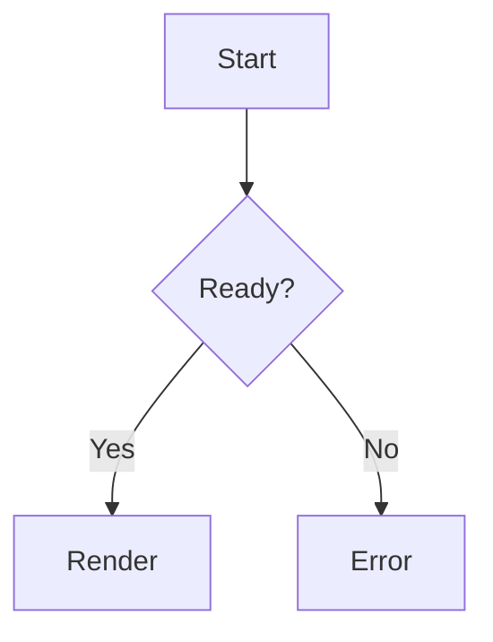

# Android Streamdown Parity Verification Plan

## 1. 验证目标

证明 EveryTalk Android Streamdown 等效层达到以下标准：

- 功能覆盖 Streamdown 主要能力。
- 官方 Streamdown props 均有 Android 等效、明确不适用或后续阶段记录。
- 流式阶段每个前缀都能稳定渲染。
- 完成态与原始 Markdown 语义一致。
- 性能在长消息和高频 token 下可接受。
- 安全策略阻断危险链接和 HTML。
- fallback 可解释、可统计、可下降。

## 2. Golden corpus

新增文件：

- `app1/app/src/test/java/com/android/everytalk/ui/components/streamdown/StreamdownParityCorpus.kt`
- `app1/app/src/test/java/com/android/everytalk/ui/components/streamdown/StreamdownParityGoldenTest.kt`

Corpus 分类：

### Inline 修补

- `**粗体`
- `__粗体`
- `*斜体`
- `_斜体`
- `***粗斜体`
- `___粗斜体`
- `~~删除线`
- `` `行内代码 ``
- `普通文字 **粗体** 后续`
- `1 < 2`
- `a > b`
- 自定义 remend handler 样例

### Link 和 image

- `[EveryTalk](https://example.com`
- `[EveryTalk](https://example.com)`
- `[EveryTalk](https://example.com` with `linkMode=protocol`
- `[EveryTalk](https://example.com` with `linkMode=text-only`
- ``
- `[相对链接](/docs/a.md`
- `[邮件](mailto:test@example.com)`
- `[电话](tel:10086)`
- `[危险](javascript:alert(1))`

### Code block

- ````text
  ```kotlin
  fun main() {
  ````
- ````text
  ```kotlin
  fun main() {
  }
  ```
  ````
- `~~~python` 变体。
- fence 内包含 `**`、`[`、`$`。

### Math

- `$x`
- `$x$`
- `$$\int`
- `$$\int_0^1 x dx$$`
- `\(x`
- `\(x\)`
- `\[x`
- `\[x\]`
- `$20`、`$20 and $30`

### Table

- 只有表头。
- 表头加分隔线。
- 完整表格。
- 表格单元格内粗体。
- 表格单元格内图片。
- 表格单元格内数学。

### Mermaid

- ` ```mermaid` 未闭合。
- flowchart。
- sequenceDiagram。
- classDiagram。
- 错误 Mermaid 源码。

### CJK

- 中文标点。
- 中英文混排。
- 中文和 inline code。
- 中文和链接。
- 中文和数学。

### Caret 和 smooth reveal

- 流式尾部 caret。
- committed nodes 不重挂载。
- tail node smooth reveal。
- 减少动态效果时禁用动画。

### Shiki parity

- Kotlin、JavaScript、Python、JSON、Markdown。
- 未支持语言回退纯文本。
- light/dark theme。
- 流式长代码降级。

### HTML 和安全

- `<a href="https://example.com">ok</a>`
- `<a href="javascript:alert(1)">bad</a>`
- `<font color="red">red</font>`
- `<script>alert(1)</script>`
- `<div`
- `<span class=`
- literal tag content：`<style>body{}`
- allowed/disallowed/unwrap/skipHtml 样例
- 常见 HTML entity。

### Config parity

- `mode=streaming/static`
- `parseIncompleteMarkdown=true/false`
- `isAnimating=true/false`
- `className` 到 Compose style token 的映射记录。
- `shikiTheme=github-light/github-dark`
- `plugins.code/mermaid/math/cjk`
- `remarkPlugins`、`rehypePlugins` 支持子集记录。
- `cdnUrl=null` 或默认值时仍只加载本地 assets。
- `preprocess`
- `defer`
- `smooth`
- `animated`
- `controls`
- `caret=block/circle`
- `dir=auto/ltr/rtl`
- `urlTransform`
- `componentsByLanguage`

## 3. 前缀稳定性测试

每个 corpus case 生成所有前缀：

```kotlin
val prefixes = finalMarkdown.indices.map { finalMarkdown.take(it + 1) }
```

对每个 prefix 断言：

- `StreamingMarkdownRepairer.repair(prefix, isStreaming = true)` 不抛异常。
- `MarkdownAstParser.parse(repaired)` 不抛异常。
- 不产生危险 URL clickable node。
- 不产生空 stableId。
- 不产生 range 反向。
- `isStreaming = false` 时 repair 结果等于原文。
- `parseIncompleteMarkdown=true` 时启用 repair。
- `parseIncompleteMarkdown=false` 时不执行 repair，并按半截 Markdown 原样显示策略处理。
- `linkMode=protocol` 生成 placeholder，但 placeholder 不可点击。
- `linkMode=text-only` 只显示 label。
- comparison operator 不产生 HTML node。
- 不完整 HTML tag 不污染后续节点。

测试命令：

```bash
cd app1
./gradlew :app:testDebugUnitTest --tests "*StreamdownParityGoldenTest*"
```

## 4. Feature flag 和入口覆盖测试

测试文件：

- `app1/app/src/test/java/com/android/everytalk/ui/components/streamdown/StreamdownFeatureFlagsTest.kt`
- `app1/app/src/test/java/com/android/everytalk/ui/components/streamdown/StreamdownEntryPointTest.kt`
- `app1/app/src/test/java/com/android/everytalk/ui/components/streamdown/StreamdownEntryPointCoverageTest.kt`

断言：

- `StreamdownFeatureFlags.enabled` 默认关闭。
- `doubleParseTelemetry` 默认开启。
- 所有入口枚举齐全：`StreamingMessageStateManager`、`ChatMessagesList`、`ContentCoordinator`、`TableAwareText`、`ImageGenerationMessagesList`、`BubbleContentTypes`。
- 所有入口只调用一次 `StreamdownRenderPipeline.prepare(...)`。
- source-stripped、local、fallback render state 保留 raw/display 分离。
- `StreamdownRenderConfigParityTest` 覆盖官方 props 映射。

命令：

```bash
cd app1
./gradlew :app:testDebugUnitTest --tests "*StreamdownFeatureFlagsTest*"
./gradlew :app:testDebugUnitTest --tests "*StreamdownEntryPointTest*"
./gradlew :app:testDebugUnitTest --tests "*StreamdownEntryPointCoverageTest*"
./gradlew :app:testDebugUnitTest --tests "*StreamdownRenderConfigParityTest*"
```

## 5. 语义一致性测试

完成态不允许把修补内容写入语义结果。

断言：

- 原文 `**abc` 完成态保持 `**abc`，不强行补 `**`。
- 流式态 `**abc` 可显示为粗体，但 `rawContent` 保持原值。
- 复制代码使用 raw code，不含 synthetic fence。
- Mermaid 下载使用 raw Mermaid 源码。
- 链接点击使用 raw URL，不使用修补 URL。
- 图片加载使用 raw image URL，不使用修补 URL。
- 表格导出使用 raw cell content，不含 synthetic delimiter。
- 重复调用 prepare 不会重复添加 synthetic suffix。

测试文件：

- `app1/app/src/test/java/com/android/everytalk/ui/components/streamdown/StreamdownRawContentIntegrityTest.kt`

命令：

```bash
cd app1
./gradlew :app:testDebugUnitTest --tests "*StreamdownRawContentIntegrityTest*"
```

## 6. Renderer 路由测试

目标：每类节点进入正确渲染器。

测试文件：

- `app1/app/src/test/java/com/android/everytalk/ui/components/streamdown/StreamdownRendererRoutingTest.kt`

断言：

- Mermaid fence -> `MermaidMarkdownPlugin`
- 普通 fence -> `CodeMarkdownPlugin`
- 数学 block -> `MathMarkdownPlugin`
- 表格 -> Table renderer
- 图片 block -> image renderer
- 危险 HTML -> fallback 或 plain text
- unsupported HTML -> fallback reason 明确

命令：

```bash
cd app1
./gradlew :app:testDebugUnitTest --tests "*StreamdownRendererRoutingTest*"
```

## 7. 安全测试

测试文件：

- `app1/app/src/test/java/com/android/everytalk/ui/components/streamdown/security/MarkdownUrlPolicyTest.kt`
- `app1/app/src/test/java/com/android/everytalk/ui/components/streamdown/security/AllowedHtmlTagsTest.kt`
- `app1/app/src/test/java/com/android/everytalk/ui/components/streamdown/security/MarkdownElementPolicyTest.kt`
- `app1/app/src/test/java/com/android/everytalk/ui/components/streamdown/security/MarkdownUrlTransformTest.kt`

URL policy 矩阵：

| URL | 预期 |
| --- | --- |
| `https://example.com` | allowed |
| `http://example.com` | allowed by config |
| `mailto:test@example.com` | allowed |
| `tel:10086` | allowed |
| `/docs/a.md` | display allowed, click guarded |
| `javascript:alert(1)` | blocked |
| `data:text/html,<script>` | blocked |
| `file:///sdcard/a` | blocked |
| `content://x` | blocked by link path |
| `data:image/png;base64,...` | image path only |
| `https://cdn.example.com/a.png` | allowed by allowedImagePrefixes |
| `https://evil.example/a.png` | blocked when prefix restricted |
| `/docs/a.md` with defaultOrigin | normalized before policy |

HTML policy 矩阵：

- 允许：`a`、`br`、`font`、`span` 子集、`p` 子集、`blockquote` 子集。
- 禁止：`script`、`iframe`、`object`、`embed`、事件属性、未知 style。
- `skipHtml=true` 时 HTML 全部按文本或剥离。
- `unwrapDisallowed=true` 时保留安全子文本。
- `literalTagContent` 内容不作为 Markdown 二次解析。

命令：

```bash
cd app1
./gradlew :app:testDebugUnitTest --tests "*MarkdownUrlPolicyTest*"
./gradlew :app:testDebugUnitTest --tests "*AllowedHtmlTagsTest*"
./gradlew :app:testDebugUnitTest --tests "*MarkdownElementPolicyTest*"
./gradlew :app:testDebugUnitTest --tests "*MarkdownUrlTransformTest*"
```

## 8. Mermaid 验证

测试层级：

1. Unit：校验 Mermaid asset manifest、license、SHA-256。
2. Unit：识别 Mermaid fence。
3. Unit：构建 WebView HTML 输入时正确 JSON escape。
4. Robolectric 或 instrumentation：WebView renderer 超时和错误态。
5. Unit：WebView 设置禁止 file/content access，拦截外部网络请求。
6. Unit：返回 SVG 二次净化，剥离脚本、事件属性、外链和 `foreignObject`。
7. 手动：真实图显示、缩放、全屏、复制、下载。

测试样例：

```markdown

```

失败样例：

```markdown
```mermaid
flowchart TD
  A -->>
```
```

验证命令：

```bash
cd app1
./gradlew :app:testDebugUnitTest --tests "*MermaidAssetManifestTest*"
./gradlew :app:testDebugUnitTest --tests "*Mermaid*"
./gradlew :app:assembleDebug
```

## 9. Shiki、CJK、caret/smooth 验证

测试文件：

- `app1/app/src/test/java/com/android/everytalk/ui/components/streamdown/plugins/ShikiParityPluginTest.kt`
- `app1/app/src/test/java/com/android/everytalk/ui/components/streamdown/plugins/CjkMarkdownPluginTest.kt`
- `app1/app/src/test/java/com/android/everytalk/ui/components/streamdown/plugins/CaretSmoothPluginTest.kt`

断言：

- 完成态代码块使用 Shiki parity token。
- Shiki token 快照与官方 `github-light`、`github-dark` 基线接近。
- 流式长代码可降级，但控件不丢失。
- 中文标点不触发表格、列表、标题误判。
- 中文和 inline code、math、link 的 raw/display 映射稳定。
- `dir=auto/ltr/rtl` 生效。
- caret 只在流式尾部显示。
- caret block/circle 样式可切换。
- smooth reveal 只影响 tail node。
- `mode=static` 禁用流式动画。
- animated start/end 回调次数正确。
- 减少动态效果时禁用动画。

命令：

```bash
cd app1
./gradlew :app:testDebugUnitTest --tests "*ShikiParityPluginTest*"
./gradlew :app:testDebugUnitTest --tests "*CjkMarkdownPluginTest*"
./gradlew :app:testDebugUnitTest --tests "*CaretSmoothPluginTest*"
```

## 10. 性能测试

测试文件：

- `app1/app/src/test/java/com/android/everytalk/ui/components/streamdown/StreamdownPerformanceTest.kt`

场景：

- 1 千字符中文。
- 1 万字符中文。
- 5 万字符混合 Markdown。
- 500 行代码块。
- 100 行表格。
- 20 个数学公式。
- 10 个 Mermaid 图。

指标：

- repair O(n)，5 万字符不超内存。
- parse 不在主线程做重型工作。
- Mermaid 每张图有超时。
- 代码高亮有缓存。
- LazyColumn 回收后不会重复全量解析。
- `defer` 启用时，主线程优先响应滚动和输入。

Debug telemetry 字段：

- `messageId`
- `rawLength`
- `repairedLength`
- `repairDurationMs`
- `parseDurationMs`
- `nodeCount`
- `fallbackReason`
- `syntaxHighlightDurationMs`
- `mermaidRenderDurationMs`
- `cjkNormalizationDurationMs`
- `smoothRevealEnabled`
- `deferEnabled`
- `securityBlockedCount`
- `configParityVersion`

命令：

```bash
cd app1
./gradlew :app:testDebugUnitTest --tests "*StreamdownPerformanceTest*"
```

## 11. Compose UI 验证

新增 androidTest：

- `app1/app/src/androidTest/java/com/android/everytalk/ui/components/streamdown/StreamdownComposeRenderTest.kt`

测试：

- 流式文本逐步更新，节点数量稳定。
- 代码块复制按钮存在。
- Mermaid 错误态存在。
- 链接点击触发安全弹窗。
- 表格复制控件存在。
- 表格全屏控件存在。
- controls config 关闭后控件消失。
- table controls boolean 和 copy、download、fullscreen 生效。
- code controls boolean 和 copy、download 生效。
- mermaid controls boolean 和 copy、download、fullscreen、panZoom 生效。
- 自定义 icons/translations 生效。
- caret 只在流式尾部。
- smooth reveal 不重挂载已提交节点。

命令：

```bash
cd app1
./gradlew :app:connectedDebugAndroidTest
```

如果本机没有设备，至少跑：

```bash
cd app1
./gradlew :app:assembleDebug
```

## 12. 手动验收脚本

手动输入或回放以下内容：

1. 逐字输出代码块。
2. 逐字输出数学公式。
3. 逐字输出 Mermaid 图。
4. 逐行输出表格。
5. 输出中文长文，混合链接、粗体、代码。
6. 点击可信链接。
7. 点击危险链接。
8. 复制代码。
9. 下载 Mermaid 图。
10. 长按用户消息和 AI 消息，确认交互不冲突。
11. 检查流式尾部 caret，完成后消失。
12. 切换深浅色主题，检查代码高亮。

通过条件：

- 不崩溃。
- 不出现整条消息闪烁。
- 半截语法不会吞掉后文。
- 完成后显示与原文语义一致。
- 外链安全弹窗行为正确。

## 13. 总验证命令

```bash
cd app1
./gradlew :app:testDebugUnitTest --tests "*Streamdown*"
./gradlew :app:testDebugUnitTest --tests "*StreamBlockParserTest*"
./gradlew :app:testDebugUnitTest --tests "*StreamBlocksRendererRoutingTest*"
./gradlew :app:testDebugUnitTest --tests "*InlineMarkdownParserTest*"
./gradlew :app:testDebugUnitTest --tests "*MarkdownElementPolicyTest*"
./gradlew :app:testDebugUnitTest --tests "*MarkdownUrlTransformTest*"
./gradlew :app:compileDebugKotlin
./gradlew :app:assembleDebug
```

## 14. 发布门槛

发布前必须满足：

- Golden corpus 全绿。
- 安全测试全绿。
- Mermaid 基础图渲染可用。
- `compileDebugKotlin` 通过。
- `assembleDebug` 通过。
- fallback reason 都可解释。
- Debug telemetry 没有明显主线程阻塞。
- Mermaid asset manifest、license、SHA-256 校验通过。
- Shiki parity、CJK、caret/smooth 测试通过。
- 官方 prop parity 测试通过。
